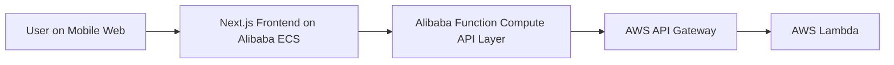

# Secure PIN App

`Secure PIN App` is a mobile-first fintech frontend built with Next.js for a hackathon use case focused on secure PIN onboarding, authentication UX, and account security flows.

The project is designed to demonstrate how a modern frontend can capture structured PIN-entry data and connect to a cross-cloud backend pipeline using Alibaba Cloud and AWS services.

## Project Overview

This project currently covers:

- Secure PIN setup with confirmation
- Account security and profile UI
- Authentication and MFA-related screens
- Behavioral PIN submission from frontend to backend
- Deployment readiness for Alibaba ECS

The main product flow is:

1. A user opens the mobile web app.
2. The user navigates to the Secure PIN flow.
3. The frontend validates the PIN setup UI and captures typing-timing data.
4. The request is sent to the backend integration layer.
5. The backend forwards the request to the Lambda-based processing flow.

## Features

- Mobile-first UI across `/`, `/account`, `/authentication`, and `/secure-pin`
- Country selector on the home page
- Dedicated account security navigation
- Separate authentication management screen
- PIN entry validation for setup and confirmation
- Submit button state control based on input completeness
- Structured request payload for backend fraud/risk analysis
- ECS-ready packaging for deployment

## Tech Stack

- `Next.js 14`
- `React 18`
- `TypeScript`
- `Tailwind CSS`
- Alibaba Cloud ECS
- Alibaba Function Compute
- AWS API Gateway
- AWS Lambda

## Pages

- `/`
  Home dashboard and mobile landing screen
- `/account`
  Account overview with payment and security sections
- `/authentication`
  Authentication methods, devices, and sessions UI
- `/secure-pin`
  6-digit PIN setup, validation, and submission flow

## Getting Started

### 1. Install Dependencies

```bash
npm install
```

### 2. Configure AWS Lambda Endpoints

Copy `.env.example` to `.env.local` and update with your AWS Lambda API Gateway URL:

```bash
cp .env.example .env.local
```

Edit `.env.local`:

```env
NEXT_PUBLIC_API_BASE_URL=https://your-api-gateway-url.execute-api.region.amazonaws.com/prod
NEXT_PUBLIC_API_KEY=your-api-key-here
NEXT_PUBLIC_PIN_CREATE_ENDPOINT=/pin/create
NEXT_PUBLIC_PIN_VERIFY_ENDPOINT=/pin/verify
NEXT_PUBLIC_PIN_UPDATE_ENDPOINT=/pin/update
NEXT_PUBLIC_PIN_RESET_ENDPOINT=/pin/reset
```

### 3. Run Development Server

```bash
npm run dev
```

Open [http://localhost:3000](http://localhost:3000) in your browser.

## API Configuration

The app is configured to call AWS Lambda endpoints for PIN operations:

- **Create PIN**: `POST /pin/create`
- **Verify PIN**: `POST /pin/verify`
- **Update PIN**: `PUT /pin/update`
- **Reset PIN**: `POST /pin/reset`

### Using the API Service

```typescript
import { pinService } from '@/lib/api/pinService';

const result = await pinService.createPin({
  session_id: 'uuid-goes-here',
  user_id: 'user-identifier',
  device: {
    platform: 'android',
    os_version: '14',
    device_model: 'SM-S928B',
  },
  location: {
    country_code: 'MY',
    latitude: 3.139,
    longitude: 101.687,
  },
  keystroke_dynamics: {
    pin_length: 6,
    inter_key_delays_ms: [120, 95, 110, 88, 142],
    hold_durations_ms: [80, 75, 90, 85, 78, 70],
    total_entry_duration_ms: 1600,
  },
});

if (result.success) {
  console.log('PIN created:', result.data);
} else {
  console.error('Error:', result.error);
}
```

## Request Payload Example

```json
{
  "session_id": "uuid-goes-here",
  "user_id": "user-identifier",
  "device": {
    "platform": "android",
    "os_version": "14",
    "device_model": "SM-S928B"
  },
  "location": {
    "country_code": "MY",
    "latitude": 3.139,
    "longitude": 101.687
  },
  "keystroke_dynamics": {
    "pin_length": 6,
    "inter_key_delays_ms": [120, 95, 110, 88, 142],
    "hold_durations_ms": [80, 75, 90, 85, 78, 70],
    "total_entry_duration_ms": 1600
  }
}
```

## Project Structure

```text
app/                    # Next.js app directory
  account/              # Account page
  authentication/       # Authentication page
  secure-pin/           # Secure PIN flow
  page.tsx              # Home page
  layout.tsx            # Root layout
  globals.css           # Global styles
components/             # React components
  BalanceCard.tsx
  BottomNav.tsx
  FavouritesSection.tsx
  GoFinanceBanner.tsx
  PageHeader.tsx
  PromoSection.tsx
  QuickActions.tsx
  RecommendedSection.tsx
lib/                    # Utilities and services
  api/
    config.ts           # API endpoints config
    client.ts           # HTTP client
    pinService.ts       # PIN service methods
deploy/
  ecs/
    secure-pin-app.service
  alibaba-ecs.md
.env.local              # Environment variables (not in git)
.env.example            # Example environment variables
```

## Build for Production

This project is configured with Next.js `standalone` output for VM deployment.

Build:

```bash
npm run build
```

Run the standard server:

```bash
npm start
```

Run the standalone server:

```bash
npm run start:standalone
```

## Alibaba ECS Deployment

Detailed ECS deployment steps are in:

[deploy/alibaba-ecs.md](./deploy/alibaba-ecs.md)

Deployment artifacts included in this repository:

- `Dockerfile` for container deployment on ECS
- `deploy/ecs/secure-pin-app.service` for direct Node.js + `systemd`
- `next.config.mjs` with `output: "standalone"`

## Architecture Diagram

The current integration flow is:

- Frontend hosted on Alibaba ECS
- Backend entry layer exposed through Alibaba Function Compute
- Alibaba Function Compute forwards the request to AWS API Gateway
- AWS API Gateway invokes Lambda for the business logic



## Architecture Explanation

1. The user interacts with the Next.js frontend hosted on Alibaba ECS.
2. When the user submits the Secure PIN form, the frontend sends the request to the backend integration layer.
3. That backend entry layer is hosted with Alibaba Function Compute.
4. Alibaba Function Compute forwards or proxies the request to AWS API Gateway.
5. AWS API Gateway routes the request to the Lambda function that performs the PIN-related business logic.
6. The response returns through the same chain back to the frontend.

This architecture allows the project to:

- host the user-facing frontend on Alibaba ECS
- use Alibaba Function Compute as the bridge layer
- preserve AWS API Gateway and Lambda for the downstream processing path

## Notes

- The repository should remain publicly accessible for hackathon evaluation.
- Ensure the repo includes setup instructions, deployment instructions, and architecture explanation.
- Update `.env.local` or production environment files with your actual backend endpoint values before deployment.
- The API client includes timeout handling with a 30-second default.
- All API calls return a consistent `ApiResponse` format.
- API key is sent via the `x-api-key` header.
- The current UI is optimized for a mobile viewport.
